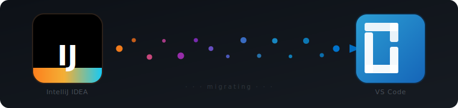

<div align="center">
  

  <h1>vscodesetup</h1>

  <p><strong>One script. Somewhat familiar IntelliJ experience. Inside VSCode.</strong></p>

  <p>
    Darcula theme · JetBrains Mono · Pylance · gopls · rust-analyzer · GitLens · SQLTools · Podman · Claude Code
  </p>
</div>

---

Migrated off a JetBrains licence and don't want to lose a week reconfiguring your editor? This script does ~~everything~~ a bunch of _things_ in one shot — theme, fonts, language servers, debuggers, AI tooling, Git, databases, containers.

## Quick start

```bash
git clone https://github.com/matthew-meen/vscodesetup.git && (cd vscodesetup && ./install.sh)
```

> Requires macOS + [Homebrew](https://brew.sh). Everything else is handled for you.

## What gets installed

| Category | What you get |
|---|---|
| **Appearance** | Darcula theme, JetBrains Mono 13pt, ligatures |
| **Python** | Pylance LSP, debugpy, pytest UI, Austin profiler |
| **Go** | gopls, Delve debugger, `go test` UI |
| **Rust** | rust-analyzer, inlay hints, Clippy, CodeLLDB, `cargo test` UI |
| **AI** | Claude Code CLI + Anthropic VSCode extension |
| **Git** | GitLens (blame/history), Git Graph (branch log) |
| **Database** | SQLTools + PostgreSQL, MySQL, SQLite drivers |
| **Containers** | Podman Desktop, Docker socket compatibility |
| **Editor** | Error Lens, Path IntelliSense, Todo Tree, EditorConfig, dotenv, YAML, TOML, Mermaid |

## What happens when you run it

```
▶ Creating Python venv …
▶ Installing Python dependencies …

════════════════════════════════════════════════════
  VSCode Setup — IntelliJ migration
════════════════════════════════════════════════════

  Dependency check     → prompts once, installs everything via brew/npm
  Extensions (25)      → skips already-installed, reports failures at the end
  settings.json        → deep-merges with yours (your values win), backs up first
  keybindings.json     → appends without overwriting, backs up first
  Podman socket        → auto-detected and written to docker.host

════════════════════════════════════════════════════
  Setup Summary
════════════════════════════════════════════════════
  ✅  VSCode             installed
  ✅  Extensions         25/25 installed
  ✅  settings.json      written (backed up to settings.json.bak.20260309_143022)
  ✅  keybindings.json   written
  ✅  Podman socket      configured (/home/user/.local/share/containers/...)
  ⚠️   Manual step: SCM panel → ⋯ → View as Tree
════════════════════════════════════════════════════
```

Safe to re-run. Every step is idempotent.

## Key settings applied

- `Cmd+S` formats then saves (via `runCommands` — no double-format conflict)
- Inlay hints always on, sticky scroll, bracket pair guides
- Tabs never auto-close, many tabs allowed, preview mode off
- Option key works as Meta in the integrated terminal
- File nesting groups `go.sum`, `Cargo.lock`, `package-lock.json` under their parents
- Gutter diff decorations always visible, width 3
- Go files use tabs; everything else uses spaces

## Manual step after running

In the SCM panel: **⋯ → View as Tree** — groups changed files by directory. VSCode doesn't expose this as a settings key so the script can't do it for you.

## Repo structure

```
install.sh                # Entry point — creates venv, installs deps, runs setup.py
setup.py                  # Orchestrates all setup steps
requirements.txt          # Python dependencies (stdlib-only for now)
logo.svg                  # The logo you're looking at
config/
  settings.json           # Base VSCode settings (~50 keys)
  keybindings.json        # Cmd+S → format + save
  extensions.txt          # 25 extension IDs across 8 categories
requirements/
  requirements.md         # Full requirements and settings spec
  opus_questions.md       # Design decisions and rationale
```
